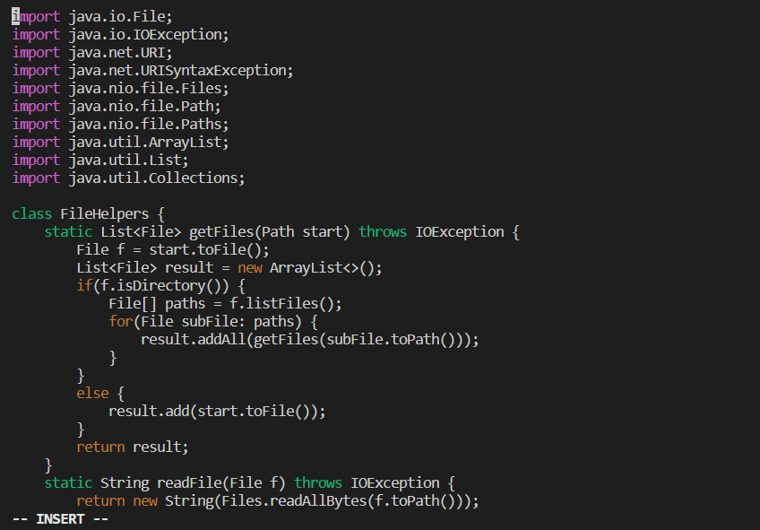
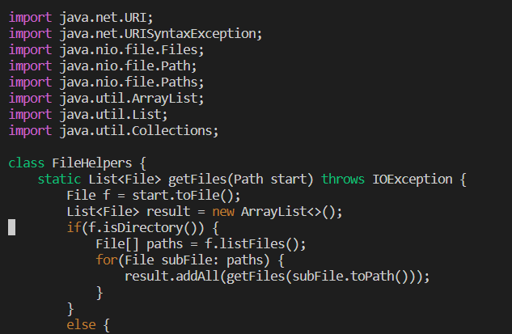
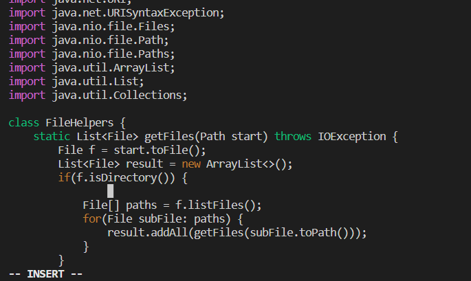
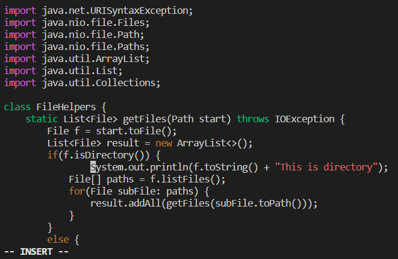
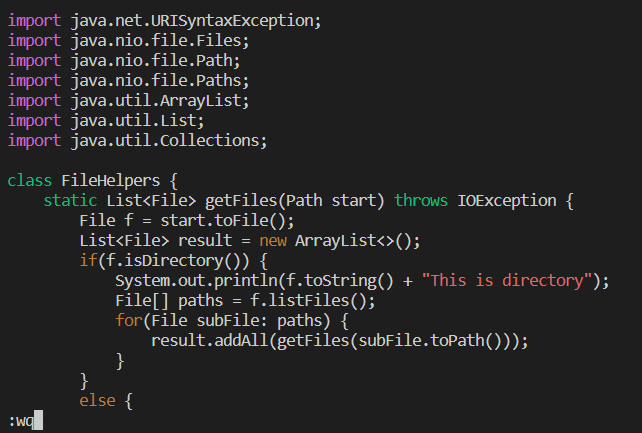
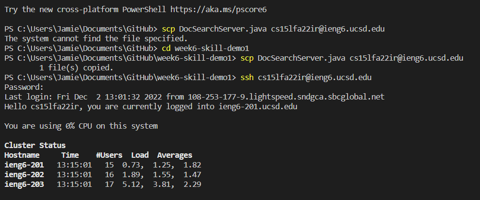
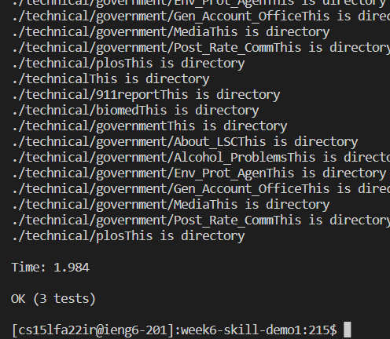
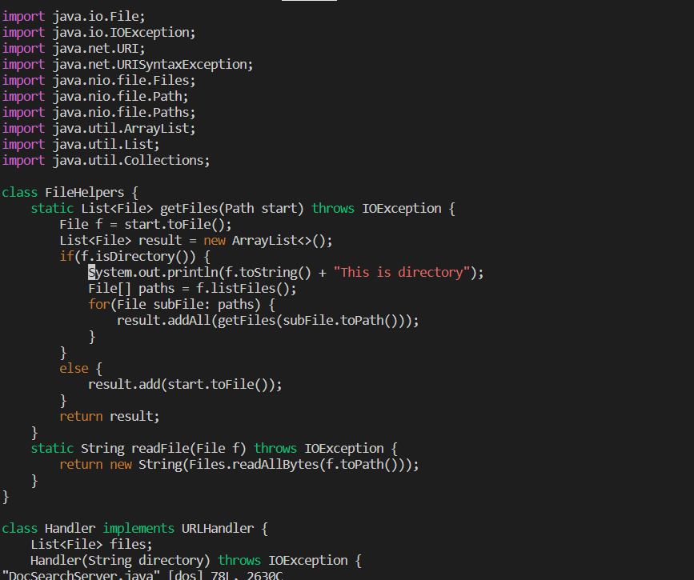
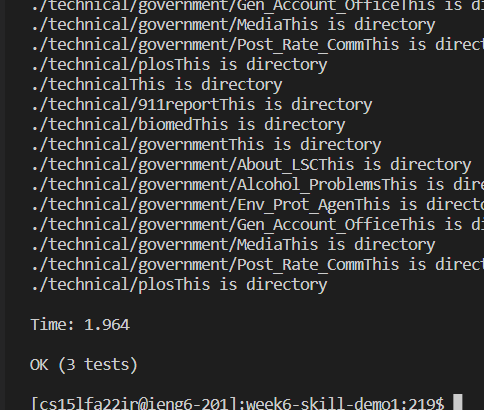

Part 1.

We will be producing a change in DocSearchServer.java in vim, by adding a new line right before File[] paths = f.listFiles(); 
that prints out the toString of and a message saying its a directory.

First keysteps I did was I started the vim program in DocSearchServer.java.

Next I will reach the point at where I am trying to add the line by clicking the downward key, I beleive I had to click it 14 times, you should be at the beggining of
line if(f.isDirectory()){. 

I will press the short cut keys <shift> + a to get to the end of that line(After hitting <shift> + A you should be in insert mode), I will add a new line by clicking enter.

After adding that newline, I will copy and paste System.out.println(f.toString() + “This is directory”); into the new line by clicking left key and right key at the same time.
  
 

After adding the new line, I made the spacing better by clicking backspace once and then space 4 times. After you must press esc to exit insert mode, and then enter in :wq to save and exit vim mode. 
  
  

Part 2.

Non-Vim method

To compare to just using vim to change the file, I then used a standard method of going changing into it. First step I cloned the repository into my github on visual studio code
and then I made the changes to the line mentioned in part 1. Afterwards I scpd it into the remote server using command "ssh DocSearchServer.java cs15lfa22ir@ieng6.ucsd.edu". This would create the copy
into my remote server. Afterwards I logged into my ssh server and then ran the command "bash test.sh". After all that, my time to complete was 1 minute 51 seconds. 

Vim method

I started off in the remote server and then I used vim into the file DocSearchServer.java. Afterwards I shifted to the line and made the change and then :wq to get out. Similar to how
I did it in part 1. After running the command "bash test.sh", my time was 29 seconds.

  

After running both ways I can say without a doubt that editing in vim was faster for me. I definetly beleive that vim is faster simply because I can just edit remotely
instead of having to scp something everytime I make a change. If I made mistakes it would be faster to use vim because if I didn't I would have to edit and make change 
and then send a copy back everytime. However, I can definelty say vim is more complicated to use than regular method of scp due to vim being super complicated. That being said, I can definetly see why vim is a very powerful tool.

